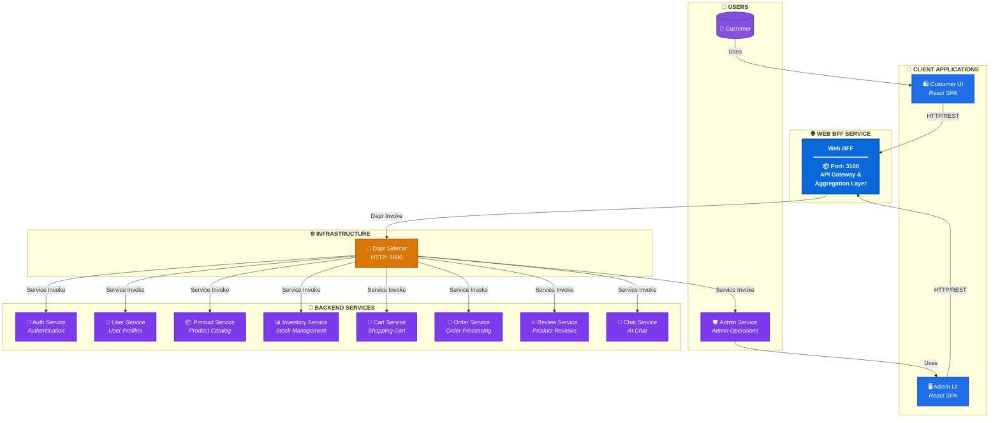

# Web BFF Service - Architecture Document

## Table of Contents

1. [Overview](#1-overview)
   - 1.1 [Purpose](#11-purpose)
   - 1.2 [Scope](#12-scope)
   - 1.3 [Service Summary](#13-service-summary)
   - 1.4 [Directory Structure](#14-directory-structure)
   - 1.5 [Key Responsibilities](#15-key-responsibilities)
   - 1.6 [References](#16-references)
2. [System Context](#2-system-context)
   - 2.1 [Context Diagram](#21-context-diagram)
   - 2.2 [External Interfaces](#22-external-interfaces)
   - 2.3 [Dependencies](#23-dependencies)
3. [API Design](#4-api-design)
   - 3.1 [Endpoint Summary](#31-endpoint-summary)
   - 3.2 [Request/Response Specifications](#32-requestresponse-specifications)
   - 3.3 [Error Response Format](#33-error-response-format)
   - 3.4 [Error Code Reference](#34-error-code-reference)
   - 3.5 [Authentication](#35-authentication)
4. [Service Communication](#4-service-communication)
   - 4.1 [Dapr Service Invocation](#41-dapr-service-invocation)
   - 4.2 [Client Architecture](#42-client-architecture)
   - 4.3 [Aggregation Patterns](#43-aggregation-patterns)
5. [Configuration](#5-configuration)
   - 5.1 [Environment Variables](#51-environment-variables)
   - 5.2 [Dapr Configuration](#52-dapr-configuration)
6. [Deployment](#6-deployment)
   - 6.1 [Deployment Targets](#61-deployment-targets)
7. [Observability](#7-observability)
   - 7.1 [Distributed Tracing](#71-distributed-tracing)
   - 7.2 [Structured Logging](#72-structured-logging)
   - 7.3 [Metrics & Alerting](#73-metrics--alerting)
8. [Error Handling](#8-error-handling)
   - 8.1 [Error Response Format](#81-error-response-format)
9. [Security](#9-security)
   - 9.1 [Authentication](#91-authentication)
   - 9.2 [Authorization](#92-authorization)
   - 9.3 [CORS Configuration](#93-cors-configuration)
   - 9.4 [Rate Limiting](#94-rate-limiting)

---

## 1. Overview

### 1.1 Purpose

The Web BFF (Backend for Frontend) Service is an API gateway and aggregation layer within the xshopai e-commerce platform. It provides a unified API for web clients, aggregating data from multiple backend microservices and handling client-specific transformations.

### 1.2 Scope

#### In Scope

- API aggregation from multiple backend services
- Request/response transformation for web clients
- JWT authentication and authorization proxy
- Rate limiting and throttling
- Request correlation ID propagation
- Health monitoring of downstream services
- Error response normalization
- CORS configuration for web clients

#### Out of Scope

- Business logic implementation (delegated to backend services)
- Data persistence (no database ownership)
- Event publishing/subscribing (pure API gateway)
- Direct payment processing

### 1.3 Service Summary

| Attribute      | Value                                  |
| -------------- | -------------------------------------- |
| Service Name   | web-bff                                |
| Tech Stack     | Node.js 20+ / Express 4.x / TypeScript |
| Database       | None (stateless gateway)               |
| Authentication | JWT (validated by auth-service)        |
| API Docs       | OpenAPI/Swagger                        |
| Messaging      | Dapr Service Invocation (no pub/sub)   |
| Main Port      | 3100                                   |
| Dapr HTTP Port | 3500                                   |
| Dapr gRPC Port | 50001                                  |

> **Note:** All services now use the standard Dapr ports (3500 for HTTP, 50001 for gRPC). This simplifies configuration and works consistently whether running via Docker Compose or individual service runs.

### 1.4 Directory Structure

```
web-bff/
├── .dapr/                      # Dapr configuration
│   └── config.yaml             # Dapr service invocation config
├── .github/                    # GitHub workflows and copilot instructions
├── .vscode/                    # VS Code settings and tasks
├── docs/                       # Documentation
│   ├── ARCHITECTURE.md         # This file
│   ├── PRD.md                  # Product requirements document
│   ├── LOCAL_DEVELOPMENT.md    # Local development guide
│   ├── LOCAL_DEVELOPMENT_DAPR.md # Dapr development guide
│   ├── PREREQUISITES.md        # Prerequisites setup
│   └── ACA_DEPLOYMENT.md       # Azure Container Apps deployment
├── src/                        # Application source code
│   ├── aggregators/            # Data aggregation logic
│   │   ├── storefront.aggregator.ts
│   │   └── admin.dashboard.aggregator.ts
│   ├── clients/                # HTTP clients for backend services
│   │   ├── index.ts            # Client exports
│   │   ├── admin.client.ts     # Admin service client
│   │   ├── auth.client.ts      # Auth service client
│   │   ├── cart.client.ts      # Cart service client
│   │   ├── inventory.client.ts # Inventory service client
│   │   ├── order.client.ts     # Order service client
│   │   ├── product.client.ts   # Product service client
│   │   ├── review.client.ts    # Review service client
│   │   └── user.client.ts      # User service client
│   ├── controllers/            # API endpoint handlers
│   │   ├── admin.controller.ts
│   │   ├── auth.controller.ts
│   │   ├── cart.controller.ts
│   │   ├── home.controller.ts
│   │   ├── operational.controller.ts
│   │   ├── order.controller.ts
│   │   ├── products.controller.ts
│   │   ├── review.controller.ts
│   │   ├── storefront.controller.ts
│   │   └── user.controller.ts
│   ├── core/                   # Core utilities
│   │   ├── config.ts           # Configuration management
│   │   ├── daprBaseClient.ts   # Base Dapr service client
│   │   └── logger.ts           # Winston logger setup
│   ├── middleware/             # Express middleware
│   │   ├── auth.middleware.ts  # JWT authentication
│   │   ├── error.middleware.ts # Error handling
│   │   └── traceContext.middleware.ts  # W3C Trace Context
│   ├── routes/                 # Route definitions
│   │   ├── index.ts            # Main router
│   │   ├── admin.routes.ts
│   │   ├── auth.routes.ts
│   │   ├── cart.routes.ts
│   │   ├── chat.routes.ts
│   │   ├── health.routes.ts
│   │   ├── home.routes.ts
│   │   ├── inventory.routes.ts
│   │   ├── operational.routes.ts
│   │   ├── order.routes.ts
│   │   ├── products.routes.ts
│   │   ├── review.routes.ts
│   │   ├── storefront.routes.ts
│   │   └── user.routes.ts
│   ├── services/               # Business logic layer
│   │   └── index.ts
│   ├── types/                  # TypeScript type definitions
│   ├── validators/             # Input validation
│   ├── app.ts                  # Express app configuration
│   └── server.ts               # Application entry point
├── tests/                      # Test suite
│   ├── unit/                   # Unit tests
│   └── integration/            # Integration tests
├── docker-compose.yml          # Local development setup
├── Dockerfile                  # Container build instructions
├── package.json                # Dependencies and scripts
├── tsconfig.json               # TypeScript configuration
├── tsc-alias.config.json       # Path alias configuration
├── run.ps1                     # Windows run script
└── run.sh                      # Linux/macOS run script
```

### 1.5 Key Responsibilities

1. **API Aggregation** - Combine data from multiple backend services into single responses
2. **Request Routing** - Route requests to appropriate backend services via Dapr
3. **Authentication Gateway** - Validate JWT tokens and propagate user context
4. **Response Transformation** - Transform backend responses for web client needs
5. **Error Normalization** - Provide consistent error responses across all services
6. **Health Monitoring** - Monitor and report downstream service health

### 1.6 References

| Document             | Link                                                                  |
| -------------------- | --------------------------------------------------------------------- |
| PRD                  | [docs/PRD.md](./PRD.md)                                               |
| Copilot Instructions | [.github/copilot-instructions.md](../.github/copilot-instructions.md) |

---

## 2. System Context

### 2.1 Context Diagram



### 2.2 External Interfaces

| System            | Direction | Protocol    | Description                         |
| ----------------- | --------- | ----------- | ----------------------------------- |
| Customer UI       | In        | HTTP/REST   | Web client API requests             |
| Admin UI          | In        | HTTP/REST   | Admin dashboard requests            |
| Auth Service      | Out       | Dapr Invoke | Authentication and token validation |
| User Service      | Out       | Dapr Invoke | User profile operations             |
| Product Service   | Out       | Dapr Invoke | Product catalog queries             |
| Inventory Service | Out       | Dapr Invoke | Stock availability queries          |
| Cart Service      | Out       | Dapr Invoke | Shopping cart operations            |
| Order Service     | Out       | Dapr Invoke | Order management                    |
| Review Service    | Out       | Dapr Invoke | Product reviews                     |
| Admin Service     | Out       | Dapr Invoke | Admin operations                    |
| Chat Service      | Out       | Dapr Invoke | AI-powered chat                     |

### 2.3 Dependencies

#### 2.3.1 Downstream Services

| Service           | Purpose                             | Required |
| ----------------- | ----------------------------------- | -------- |
| Auth Service      | JWT validation, login/register      | Yes      |
| User Service      | User profile management             | Yes      |
| Product Service   | Product catalog, search, categories | Yes      |
| Inventory Service | Stock availability, reservation     | Yes      |
| Cart Service      | Shopping cart CRUD                  | Yes      |
| Order Service     | Order creation and management       | Yes      |
| Review Service    | Product reviews and ratings         | No       |
| Admin Service     | Admin dashboard operations          | No       |
| Chat Service      | AI chat functionality               | No       |

#### 2.3.2 Infrastructure Dependencies

| Component    | Purpose            | Port/Connection         |
| ------------ | ------------------ | ----------------------- |
| Dapr Sidecar | Service invocation | HTTP: 3500, gRPC: 50001 |

---

## 3. API Design

### 3.1 Endpoint Summary

#### Public Endpoints (No Auth Required)

| Method | Endpoint               | Description               |
| ------ | ---------------------- | ------------------------- |
| GET    | `/`                    | Service info              |
| GET    | `/health`              | Health check              |
| GET    | `/health/ready`        | Readiness probe           |
| GET    | `/health/live`         | Liveness probe            |
| GET    | `/api/storefront`      | Aggregated home page data |
| GET    | `/api/products`        | Product listing           |
| GET    | `/api/products/:id`    | Product details           |
| GET    | `/api/products/search` | Product search            |
| POST   | `/api/auth/login`      | User login                |
| POST   | `/api/auth/register`   | User registration         |
| POST   | `/api/auth/refresh`    | Token refresh             |

#### Protected Endpoints (Auth Required)

| Method | Endpoint                   | Description         |
| ------ | -------------------------- | ------------------- |
| GET    | `/api/users`               | Get user profile    |
| PATCH  | `/api/users`               | Update user profile |
| GET    | `/api/users/addresses`     | Get user addresses  |
| POST   | `/api/users/addresses`     | Add address         |
| PUT    | `/api/users/addresses/:id` | Update address      |
| DELETE | `/api/users/addresses/:id` | Delete address      |
| GET    | `/api/cart`                | Get shopping cart   |
| POST   | `/api/cart/items`          | Add item to cart    |
| PUT    | `/api/cart/items/:id`      | Update cart item    |
| DELETE | `/api/cart/items/:id`      | Remove cart item    |
| POST   | `/api/orders`              | Create order        |
| GET    | `/api/orders`              | List orders         |
| GET    | `/api/orders/:id`          | Get order details   |
| POST   | `/api/reviews`             | Create review       |
| POST   | `/api/auth/logout`         | User logout         |

#### Admin Endpoints (Admin Role Required)

| Method | Endpoint               | Description           |
| ------ | ---------------------- | --------------------- |
| GET    | `/api/admin/dashboard` | Dashboard aggregation |
| GET    | `/api/admin/users`     | List all users        |
| GET    | `/api/admin/users/:id` | Get user details      |
| GET    | `/api/admin/inventory` | Inventory overview    |
| GET    | `/api/admin/orders`    | Order management      |

### 3.2 Request/Response Specifications

#### GET /api/storefront

**Description:** Returns aggregated data for the storefront home page.

**Response (200 OK):**

```json
{
  "trending_products": [
    {
      "id": "prod_123",
      "name": "Premium Cotton T-Shirt",
      "price": 29.99,
      "images": ["https://cdn.example.com/img.jpg"],
      "rating": 4.5,
      "reviewCount": 128,
      "inStock": true
    }
  ],
  "trending_categories": [
    {
      "name": "Electronics",
      "product_count": 150,
      "featured_product": {...}
    }
  ]
}
```

#### POST /api/auth/login

**Description:** Authenticates user and returns tokens.

**Request:**

```json
{
  "email": "user@example.com",
  "password": "securePassword123"
}
```

**Response (200 OK):**

```json
{
  "success": true,
  "user": {
    "id": "user_123",
    "email": "user@example.com",
    "firstName": "John",
    "lastName": "Doe"
  },
  "accessToken": "eyJhbGciOiJIUzI1NiIs...",
  "refreshToken": "eyJhbGciOiJIUzI1NiIs..."
}
```

### 3.3 Error Response Format

All error responses follow a consistent structure:

```json
{
  "success": false,
  "error": {
    "code": "ERROR_CODE",
    "message": "Human-readable error description",
    "details": {},
    "traceId": "abc123-def456"
  }
}
```

### 3.4 Error Code Reference

| Code                  | HTTP Status | Description                       |
| --------------------- | ----------- | --------------------------------- |
| `UNAUTHORIZED`        | 401         | Missing or invalid authentication |
| `FORBIDDEN`           | 403         | Insufficient permissions          |
| `NOT_FOUND`           | 404         | Resource not found                |
| `VALIDATION_ERROR`    | 400         | Request validation failed         |
| `SERVICE_UNAVAILABLE` | 503         | Downstream service unavailable    |
| `INTERNAL_ERROR`      | 500         | Unexpected server error           |

### 3.5 Authentication

The BFF validates JWT tokens by proxying to auth-service and propagating user context to downstream services.

**Token Flow:**

1. Client sends request with `Authorization: Bearer <token>` header
2. BFF extracts token and validates via auth-service
3. User context (userId, roles) extracted from token
4. Context propagated to downstream services via headers

---

## 4. Service Communication

### 4.1 Dapr Service Invocation

The BFF uses Dapr service invocation for all downstream service calls.

**Configuration:**

```yaml
# .dapr/config.yaml
apiVersion: dapr.io/v1alpha1
kind: Configuration
metadata:
  name: web-bff-config
spec:
  tracing:
    samplingRate: '1'
    zipkin:
      endpointAddress: 'http://localhost:9411/api/v2/spans'
```

**Service App IDs:**

| Service           | App ID            |
| ----------------- | ----------------- |
| Auth Service      | auth-service      |
| User Service      | user-service      |
| Product Service   | product-service   |
| Inventory Service | inventory-service |
| Cart Service      | cart-service      |
| Order Service     | order-service     |
| Review Service    | review-service    |
| Admin Service     | admin-service     |
| Chat Service      | chat-service      |

### 4.2 Client Architecture

Each backend service has a dedicated client class that extends `DaprBaseClient`:

```typescript
// src/core/daprBaseClient.ts
export class DaprBaseClient {
  protected serviceAppId: string;
  protected daprClient: DaprClient;

  async get<T>(path: string, headers?: Record<string, string>): Promise<T>;
  async post<T>(path: string, body: unknown, headers?: Record<string, string>): Promise<T>;
  async put<T>(path: string, body: unknown, headers?: Record<string, string>): Promise<T>;
  async delete<T>(path: string, headers?: Record<string, string>): Promise<T>;
}
```

### 4.3 Aggregation Patterns

The BFF implements several aggregation patterns:

1. **Parallel Aggregation** - Multiple independent service calls executed in parallel
2. **Sequential Aggregation** - Dependent calls executed in sequence
3. **Fallback Aggregation** - Graceful degradation when services unavailable

---

## 5. Configuration

### 5.1 Environment Variables

| Variable                   | Description                            | Default                 |
| -------------------------- | -------------------------------------- | ----------------------- |
| `NODE_ENV`                 | Environment (development/production)   | `development`           |
| `PORT`                     | HTTP server port                       | `3100`                  |
| `HOST`                     | Server bind address                    | `0.0.0.0`               |
| `ALLOWED_ORIGINS`          | CORS allowed origins (comma-separated) | `http://localhost:3000` |
| `LOG_LEVEL`                | Logging level                          | `info`                  |
| `DAPR_HTTP_PORT`           | Dapr sidecar HTTP port                 | `3500`                  |
| `DAPR_GRPC_PORT`           | Dapr sidecar gRPC port                 | `50001`                 |
| `AUTH_SERVICE_APP_ID`      | Auth service Dapr app ID               | `auth-service`          |
| `USER_SERVICE_APP_ID`      | User service Dapr app ID               | `user-service`          |
| `PRODUCT_SERVICE_APP_ID`   | Product service Dapr app ID            | `product-service`       |
| `INVENTORY_SERVICE_APP_ID` | Inventory service Dapr app ID          | `inventory-service`     |
| `CART_SERVICE_APP_ID`      | Cart service Dapr app ID               | `cart-service`          |
| `ORDER_SERVICE_APP_ID`     | Order service Dapr app ID              | `order-service`         |
| `REVIEW_SERVICE_APP_ID`    | Review service Dapr app ID             | `review-service`        |
| `ADMIN_SERVICE_APP_ID`     | Admin service Dapr app ID              | `admin-service`         |
| `CHAT_SERVICE_APP_ID`      | Chat service Dapr app ID               | `chat-service`          |

### 5.2 Dapr Configuration

**File:** `.dapr/config.yaml`

```yaml
apiVersion: dapr.io/v1alpha1
kind: Configuration
metadata:
  name: web-bff-config
spec:
  tracing:
    samplingRate: '1'
    zipkin:
      endpointAddress: 'http://localhost:9411/api/v2/spans'
  features:
    - name: AppHealthCheck
      enabled: true
```

---

## 6. Deployment

### 6.1 Deployment Targets

| Environment | Platform             | Documentation                                            |
| ----------- | -------------------- | -------------------------------------------------------- |
| Local       | Docker + Dapr        | [LOCAL_DEVELOPMENT_DAPR.md](./LOCAL_DEVELOPMENT_DAPR.md) |
| Azure       | Azure Container Apps | [ACA_DEPLOYMENT.md](./ACA_DEPLOYMENT.md)                 |

---

## 7. Observability

### 7.1 Distributed Tracing

The BFF implements W3C Trace Context standard for distributed tracing:

**Headers Propagated:**

- `traceparent` - W3C trace context header
- `x-correlation-id` - Correlation ID for request tracking

**Middleware:** `traceContext.middleware.ts`

```typescript
// Extracts or generates trace context
// Attaches traceId and spanId to request
// Propagates to all downstream calls
```

### 7.2 Structured Logging

Winston logger with JSON format:

```json
{
  "timestamp": "2025-01-24T10:30:00.000Z",
  "level": "info",
  "message": "Request completed",
  "service": "web-bff",
  "traceId": "abc123",
  "spanId": "def456",
  "method": "GET",
  "path": "/api/products",
  "statusCode": 200,
  "duration": 45
}
```

### 7.3 Metrics & Alerting

| Metric                   | Description                            |
| ------------------------ | -------------------------------------- |
| `http_requests_total`    | Total HTTP requests by endpoint/status |
| `http_request_duration`  | Request duration histogram             |
| `downstream_calls_total` | Downstream service call count          |
| `downstream_errors`      | Downstream service error count         |

---

## 8. Error Handling

### 8.1 Error Response Format

All errors are normalized to a consistent format:

```json
{
  "success": false,
  "error": {
    "code": "ERROR_CODE",
    "message": "Human-readable message",
    "details": {},
    "traceId": "trace-id"
  }
}
```

**Error Handling Strategy:**

1. Downstream errors mapped to appropriate HTTP status
2. Sensitive error details not exposed to clients
3. All errors logged with trace context
4. Graceful degradation for non-critical services

---

## 9. Security

### 9.1 Authentication

JWT-based authentication with tokens validated by auth-service:

1. Token extracted from `Authorization` header or cookies
2. Token validated via auth-service
3. User context attached to request
4. Context propagated to downstream services

### 9.2 Authorization

Role-based access control:

| Role     | Access Level                   |
| -------- | ------------------------------ |
| customer | Own profile, cart, orders      |
| admin    | All resources, admin endpoints |

### 9.3 CORS Configuration

```typescript
app.use(
  cors({
    origin: config.allowedOrigins,
    credentials: true,
    exposedHeaders: ['traceparent'],
  })
);
```

### 9.4 Rate Limiting

IP-based rate limiting (future implementation):

| Endpoint Type | Limit       |
| ------------- | ----------- |
| Public APIs   | 100 req/min |
| Auth APIs     | 10 req/min  |
| Admin APIs    | 50 req/min  |
